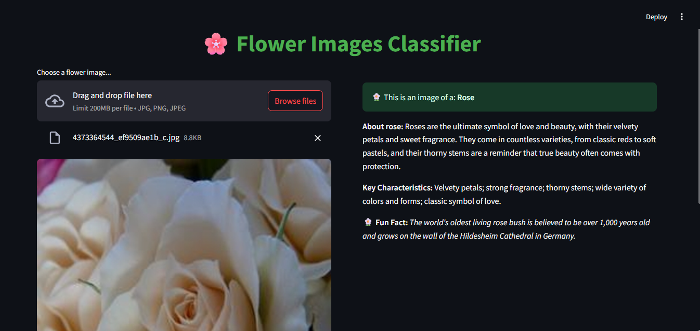

# 🌼 Flower Image Classifier

A deep learning project that classifies flower images into 14 categories using transfer learning with PyTorch. This project explores three CNN architectures — EfficientNet-B0, ResNet34, and DenseNet121 — and evaluates their performance on a curated flower image dataset.

---

## Dataset

- Source: [Kaggle – Flower Classification](https://www.kaggle.com/datasets/marquis03/flower-classification)
- Total: 13,642 training images + 98 held-out test images
- Classes: 14 flower species (e.g., rose, tulip, iris, dandelion)

---

## Model Architectures

Implemented transfer learning using pretrained weights from:
- 🔸 **EfficientNet-B0**
- 🔹 **ResNet34**
- 🔸 **DenseNet121** *(best performer)*

All base layers were frozen, and custom classifiers were added for fine-tuning.

---

## Training Details

- Loss: `CrossEntropyLoss`
- Optimizer: `Adam`
- Augmentations: Resize, rotation, color jitter, horizontal flip
- Trained on GPU via Google Colab

---

## Performance

| Model        | Val Acc | Test Acc | Train Acc |
|--------------|---------|----------|-----------|
| DenseNet121  | 95.46%  | 94.90%   | 98.08%    |
| ResNet34     | 93.92%  | —        | 96.11%    |
| EfficientNet | 89.85%  | —        | 86.14%    |

---

## Final Evaluation

- **DenseNet121** evaluated on held-out test set
- Classification Accuracy: **94.90%**
- F1-score (macro): **0.95**
- Confusion Matrix shows strong class separation

---

## Files

- `flower_images_classifier.ipynb` – Full model training + evaluation
- `models/` – Saved `.pth` files
- `app/main.py` – [https://flower-images-classifier.streamlit.app/](https://flower-images-classifier.streamlit.app/)

---

## Preview



---
## Getting Started

1. Clone the repo
2. Install requirements  
   ```bash
   pip install -r requirements.txt
   ```
3. Launch the Streamlit app
    ```bash
    cd app
    streamlit run main.py
    ```
---
## Next Steps

- Add Grad-CAM visualizations for interpretability
